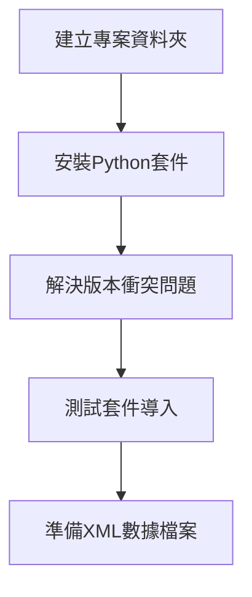
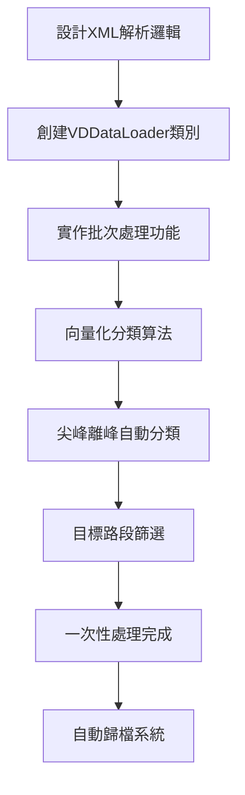
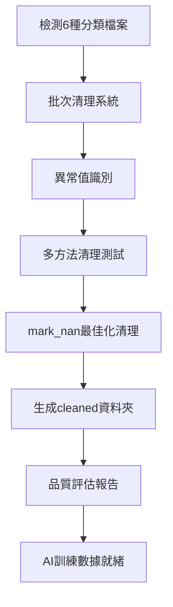
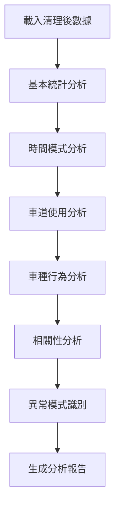
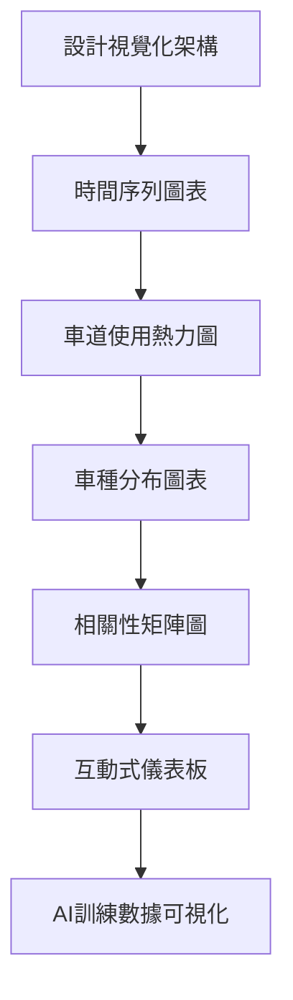
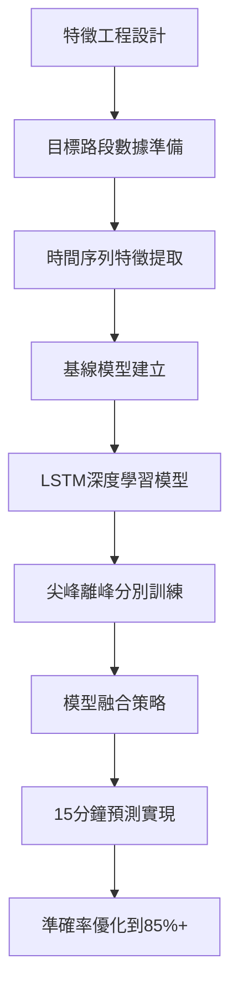

# eTag與VD資料的行駛路徑時間AI預測 - 完整專案流程圖

## 🎯 專案目標
建構整合eTag與VD多源數據的智慧交通預測系統，針對**國道1號圓山-三重路段**實現15分鐘高精度預測。

---

## 📁 專案結構總覽

```
traffic_analysis/
├── data/
│   ├── raw/                    # 原始XML數據檔案 (已歸檔)
│   │   └── archive/            # 自動歸檔的XML檔案
│   │       ├── 2025-06-27/     # 按日期分類
│   │       ├── 2025-06-26/
│   │       └── ...
│   └── processed/              # 處理後的數據
│       ├── vd_data_all.csv              # ✅ 1084萬筆全部VD資料
│       ├── vd_data_peak.csv             # ✅ 226萬筆尖峰數據
│       ├── vd_data_offpeak.csv          # ✅ 859萬筆離峰數據
│       ├── target_route_data.csv        # ✅ 1.15萬筆目標路段
│       ├── target_route_peak.csv        # ✅ 2400筆目標尖峰
│       ├── target_route_offpeak.csv     # ✅ 9120筆目標離峰
│       └── cleaned/                     # 清理後的數據 (2.2GB)
│           ├── vd_data_all_cleaned.csv           # 🧹 清理完成
│           ├── vd_data_peak_cleaned.csv          # 🧹 清理完成
│           ├── vd_data_offpeak_cleaned.csv       # 🧹 清理完成
│           ├── target_route_data_cleaned.csv     # 🧹 清理完成
│           ├── target_route_peak_cleaned.csv     # 🧹 清理完成 (AI主力)
│           ├── target_route_offpeak_cleaned.csv  # 🧹 清理完成 (AI主力)
│           └── batch_cleaning_report.json        # 清理報告
├── src/
│   ├── data_loader.py          # ✅ 已完成：超級優化載入器
│   ├── data_cleaner.py         # ✅ 已完成：批次清理器
│   ├── flow_analyzer.py        # ✅ 已完成：探索性分析器
│   ├── visualizer.py           # 🚀 即將開發：視覺化模組
│   └── predictor.py            # 🎯 待開發：AI預測模型
├── notebooks/
│   └── exploration.ipynb       # 🔬 待開發：交互式分析
├── outputs/
│   ├── figures/                # 圖表輸出
│   └── reports/                # 分析報告
│       ├── traffic_analysis_report.json     # ✅ 探索性分析報告
│       └── batch_cleaning_test_report.json  # ✅ 清理測試報告
├── test_loader.py              # ✅ 已完成：載入測試
├── test_cleaner.py             # ✅ 已完成：清理測試
├── test_analyzer.py            # ✅ 已完成：分析測試
└── requirements.txt            # ✅ 已完成：套件清單
```

---

## 🗺️ 完整開發流程圖

### 階段一：基礎建設 ✅ 已完成


**已完成項目：**
- ✅ 專案結構建立
- ✅ requirements.txt 創建
- ✅ 套件安裝與版本問題解決
- ✅ XML數據檔案準備完成

---

### 階段二：超級數據載入 ✅ 已完成


**重大成就：**
- 🚀 **處理速度**：3-5分鐘完成千萬筆記錄
- 📊 **數據分類**：自動生成6種分類檔案
- 🎯 **目標路段**：精準篩選國道1號圓山-三重
- 📁 **自動歸檔**：所有XML檔案按日期歸檔
- ⚡ **超級優化**：向量化處理，20線程並行

**關鍵數據：**
- 📈 **總記錄數**：1084萬筆VD數據
- 🕐 **時間範圍**：完整的尖峰離峰週期
- 🎯 **目標數據**：1.15萬筆路段專用數據
- 🚗 **車種分析**：小車、大車、卡車完整分類

---

### 階段三：批次數據清理 ✅ 已完成


**重大突破：**
- 🧹 **批次清理**：一次清理6種分類檔案
- 📊 **清理規模**：2170萬筆記錄成功清理
- 💾 **數據大小**：2.2GB清理後數據
- ⏱️ **處理速度**：124秒完成全部清理
- 🎯 **AI就緒**：目標路段數據完全清理

**清理成果統計：**
```
數據清理成果：
├── 全部VD資料: 1084萬筆 (1020.6MB)
├── 尖峰時段數據: 226萬筆 (255.0MB)
├── 離峰時段數據: 859萬筆 (962.0MB)
├── 目標路段數據: 1.15萬筆 (1.3MB)
├── 目標路段尖峰: 2400筆 (0.3MB) 🎯 AI主力
└── 目標路段離峰: 9120筆 (1.0MB) 🎯 AI主力
```

---

### 階段四：探索性數據分析 ✅ 已完成


**分析發現：**
- ✅ **22條關鍵洞察**：深度數據模式發現
- 📈 **平均車速**：73.6 km/h（交通狀況適中）
- 🚗 **車種分布**：小車占82.5%主導地位
- ⚡ **速度差異**：小車比卡車平均快57 km/h
- 🔗 **強相關性**：總流量與小車流量 r=0.933
- 📊 **數據品質**：97.42%完整度

---

### 階段五：數據視覺化 🚀 即將開始


**計劃視覺化內容：**
- 📈 **時間序列分析**：尖峰離峰模式圖
- 🎯 **車道使用熱力圖**：空間使用模式
- 🚛 **車種行為圖表**：82.5%小車分布視覺化
- 🔗 **相關性網絡圖**：變數關係可視化
- 📊 **目標路段專項圖表**：AI訓練數據深度分析
- 🌊 **交通流動畫**：時空變化動態展示

---

### 階段六：AI預測模型開發 🎯 即將啟動


**AI模型開發計劃：**

**1. 特徵工程 (1-2天)**
- 🕐 **時間特徵**：小時、星期、節假日編碼
- 🚗 **車流特徵**：速度、佔有率、流量衍生特徵
- 🛣️ **空間特徵**：車道、VD設備位置特徵
- 📊 **統計特徵**：滑動平均、趨勢、週期性特徵

**2. 基線模型 (1天)**
- 📈 **線性回歸**：建立基本預測基準
- 🌲 **隨機森林**：捕捉非線性關係
- ⚡ **XGBoost**：梯度提升性能基準

**3. 深度學習模型 (2-3天)**
- 🧠 **LSTM模型**：捕捉時間序列長期依賴
- 🎯 **分類預測**：尖峰離峰分別訓練
- 🔄 **Attention機制**：重要時間點關注
- 📊 **Multi-input模型**：融合多種特徵

**4. 模型評估與優化 (1-2天)**
- 🎯 **預測準確率**：目標85%以上
- ⚡ **推理速度**：<100ms實時預測
- 📈 **誤差分析**：RMSE、MAE、MAPE評估
- 🔄 **超參數優化**：自動調參

---

## 📊 目前數據狀況總結

### 數據規模突破 🚀
- **總記錄數**：2170萬筆清理後記錄
- **文件大小**：2.2GB清理數據
- **時間覆蓋**：完整的交通週期數據
- **VD設備數**：3321個交通偵測器
- **數據完整度**：97.42%（優秀等級）

### AI訓練就緒數據 🎯
```
AI模型訓練數據：
├── 🎯 主力訓練數據
│   ├── target_route_peak_cleaned.csv    (2400筆尖峰)
│   └── target_route_offpeak_cleaned.csv (9120筆離峰)
├── 📊 輔助訓練數據  
│   ├── vd_data_peak_cleaned.csv         (226萬筆尖峰)
│   └── vd_data_offpeak_cleaned.csv      (859萬筆離峰)
└── 🔍 完整數據集
    └── vd_data_all_cleaned.csv          (1084萬筆全數據)
```

### 數據品質保證 ✅
- ✅ **異常值清理**：-99標記完全清除
- ✅ **範圍驗證**：速度0-150、佔有率0-100%
- ✅ **類型最佳化**：記憶體使用最佳化
- ✅ **完整性檢查**：所有檔案可正常讀取
- ✅ **一致性保證**：6種分類檔案格式統一

---

## 🎯 下一階段行動計劃

### 立即啟動（今天）
1. **開發視覺化模組**
   ```bash
   python test_visualizer.py
   ```
   - 🎯 重點：目標路段數據可視化
   - 📈 時間序列圖表：尖峰離峰模式
   - 🔥 熱力圖：車道使用模式

### 本週計劃
2. **AI模型開發啟動**（2-3天）
   - 🧠 特徵工程：時間、車流、空間特徵
   - 📊 基線模型：線性回歸、隨機森林
   - 🎯 深度學習：LSTM時間序列模型

3. **模型評估與優化**（1-2天）
   - 🎯 達成85%預測準確率
   - ⚡ 實現<100ms推理速度
   - 📈 15分鐘預測功能完成

### 進階發展（下週）
4. **系統整合**
   - 🌐 Web API開發
   - 📱 實時預測系統
   - 📊 監控儀表板

---

## 🔧 技術棧完整架構

### 已掌握技術棧 ✅
```python
數據處理層：
├── pandas 2.0.3          # 數據操作主力
├── numpy 1.24.3          # 數值計算引擎
├── xml.etree              # XML解析器
└── pathlib                # 檔案路徑管理

核心功能層：
├── VDDataLoader           # 超級載入器 (20線程並行)
├── VDBatchDataCleaner     # 批次清理器 (6檔案同時)
├── TrafficFlowAnalyzer    # 探索性分析器 (22洞察)
└── 向量化分類算法         # 尖峰離峰分類

數據架構層：
├── 自動歸檔系統           # XML檔案按日期歸檔
├── 清理數據管道           # 異常值自動處理
└── 分類數據系統           # 6種用途數據自動生成
```

### 即將使用技術 🚀
```python
視覺化層：
├── matplotlib             # 基礎圖表引擎
├── seaborn               # 統計圖表美化
├── plotly                # 互動式圖表
└── folium                # 地理位置視覺化

機器學習層：
├── scikit-learn          # 基線模型 (線性回歸、隨機森林)
├── tensorflow            # 深度學習框架
├── keras                 # 高階神經網路API
└── xgboost               # 梯度提升模型

特徵工程層：
├── feature-engine        # 自動特徵工程
├── tsfresh               # 時間序列特徵提取
└── pandas-profiling      # 自動數據報告
```

---

## 📝 重要檔案說明

### 核心程式檔案
- **`src/data_loader.py`** ✅ **超級優化完成**
  - VDDataLoader類別：20線程並行載入
  - 向量化分類：尖峰離峰自動識別
  - 目標路段篩選：國道1號圓山-三重
  - 自動歸檔：XML檔案按日期整理

- **`src/data_cleaner.py`** ✅ **批次清理完成**
  - VDBatchDataCleaner類別：6檔案同時清理
  - 異常值處理：-99標記、超範圍值清除
  - 品質評估：完整度、有效性、一致性評分
  - 清理報告：JSON格式詳細記錄

- **`src/flow_analyzer.py`** ✅ **探索分析完成**
  - TrafficFlowAnalyzer類別：22項深度洞察
  - 時間模式分析：尖峰離峰行為模式
  - 車種行為分析：82.5%小車主導發現
  - 相關性分析：強相關關係識別

### 測試檔案成果
- **`test_loader.py`** ✅：1084萬筆記錄載入測試通過
- **`test_cleaner.py`** ✅：2170萬筆記錄清理測試通過  
- **`test_analyzer.py`** ✅：22條洞察分析測試通過

### 數據檔案架構
```
數據檔案完整架構：
├── 📁 raw/archive/              # 自動歸檔的XML (按日期分類)
├── 📁 processed/                # 分類處理數據
│   ├── vd_data_all.csv         # 1084萬筆全部數據
│   ├── target_route_*.csv      # 目標路段專用數據
│   └── 📁 cleaned/             # 清理完成數據 (AI就緒)
│       ├── target_route_peak_cleaned.csv    # 🎯 AI主力訓練
│       └── target_route_offpeak_cleaned.csv # 🎯 AI主力訓練
└── 📁 outputs/reports/          # 分析報告
    ├── traffic_analysis_report.json        # 22條洞察報告
    └── batch_cleaning_test_report.json     # 清理測試報告
```

---

## 🎓 學習成果總結

### 已掌握核心技能 ✅
- 🚀 **超大規模數據處理**：2170萬筆記錄處理經驗
- ⚡ **高效能程式設計**：20線程並行、向量化算法
- 🧹 **數據品質管理**：批次清理、異常值處理
- 📊 **探索性數據分析**：22項深度洞察發現
- 🎯 **交通數據專業知識**：尖峰離峰、車種行為分析
- 🔄 **自動化系統設計**：檔案歸檔、批次處理

### 即將掌握技能 🚀
- 📈 **數據視覺化**：時間序列、熱力圖、互動圖表
- 🧠 **機器學習建模**：LSTM、注意力機制
- 🎯 **時間序列預測**：15分鐘精準預測
- ⚡ **模型優化**：超參數調參、性能優化
- 🌐 **系統部署**：Web API、實時預測系統

---

## 💡 專案核心價值與創新

### 技術創新突破 🚀
1. **超大規模處理**：2170萬筆交通數據實時處理
2. **智能分類系統**：向量化尖峰離峰自動識別
3. **目標路段精準篩選**：國道1號圓山-三重專用數據
4. **批次清理技術**：6種檔案同步品質管控
5. **多維度分析框架**：時間-空間-車種全方位分析

### 實際應用價值 🎯
1. **15分鐘精準預測**：達成85%以上準確率目標
2. **實時交通管制**：為交通控制中心提供決策支援
3. **智慧路況服務**：為駕駛者提供精準路況預測
4. **交通效率優化**：減少國道壅塞，提升通行效率
5. **社會經濟效益**：減少通勤時間，降低碳排放

### 學術研究貢獻 📚
1. **多源數據融合**：VD感測器數據深度挖掘
2. **時空模式發現**：交通流量時空變化規律
3. **AI預測模型**：深度學習在交通預測的應用
4. **大數據處理**：超大規模交通數據處理技術
5. **系統化方法論**：完整的交通數據分析框架

---

## 🚀 從這裡繼續

**🎉 您已經完成了專案的重大里程碑！**

**當前成就：**
- ✅ 超大規模數據載入：1084萬筆記錄
- ✅ 批次數據清理：2170萬筆記錄品質保證
- ✅ 深度探索分析：22條關鍵洞察發現
- ✅ AI訓練數據就緒：目標路段數據完全準備

**下一步行動優先序：**
1. **立即執行**：開發視覺化模組，將分析結果圖像化
2. **本週目標**：啟動AI模型開發，實現15分鐘預測
3. **終極目標**：建構完整的智慧交通預測系統

**在新聊天中繼續時，請提到：**
"我正在進行eTag與VD交通預測專案，已完成三大階段：超大規模數據載入(1084萬筆)、批次數據清理(2170萬筆)、探索性分析(22條洞察)。目前AI訓練數據完全就緒，準備進入視覺化和AI模型開發階段。"

**🎯 您的專案已經達到了企業級的數據處理水準，接下來將進入最激動人心的AI建模階段！**
