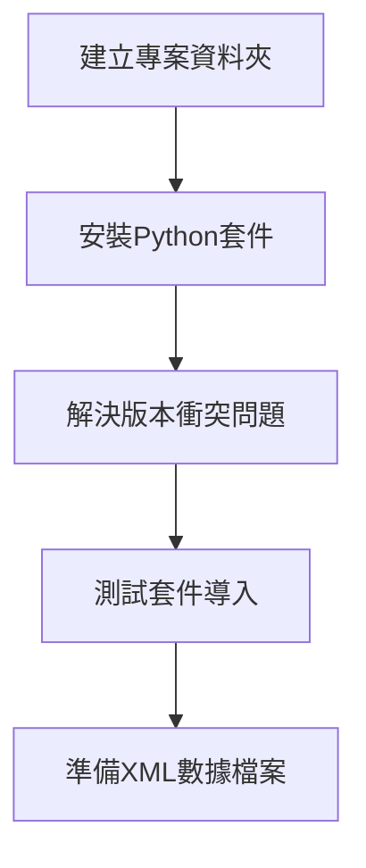
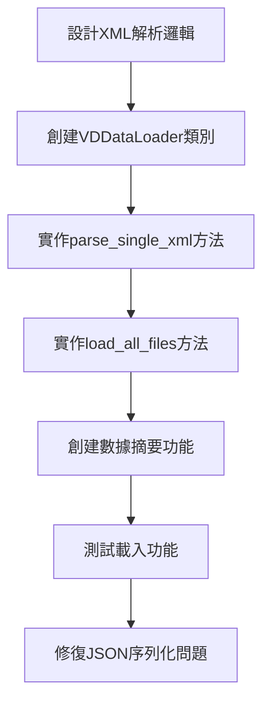
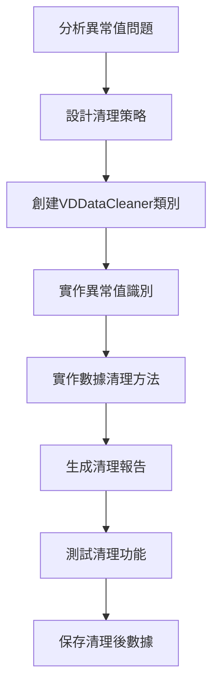
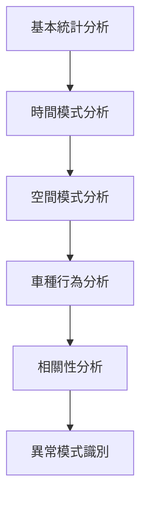
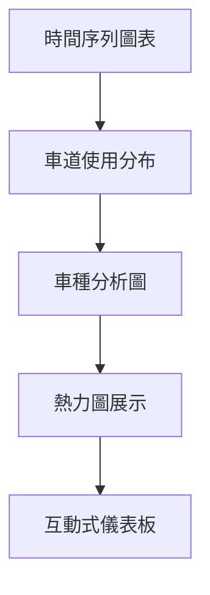
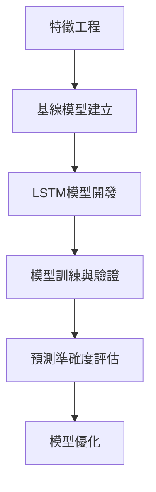

# eTag與VD資料的行駛路徑時間AI預測 - 完整專案流程圖

## 🎯 專案目標
建構整合eTag與VD多源數據的智慧交通預測系統，針對**國道1號圓山-三重路段**實現15分鐘高精度預測。

---

## 📁 專案結構總覽

```
traffic_analysis/
├── data/
│   ├── raw/                    # 原始XML數據檔案
│   │   ├── VD 靜態資訊 (1).txt  # 2025-06-27數據
│   │   ├── VD 靜態資訊 (2).txt  # 2025-06-26數據
│   │   ├── VD 靜態資訊 (3).txt  # 2025-06-25數據
│   │   ├── VD 靜態資訊 (4).txt  # 2025-06-24數據
│   │   └── VD 靜態資訊 (5).txt  # 2025-06-23數據
│   └── processed/              # 處理後的數據
│       ├── vd_data_processed.csv    # 原始載入數據
│       ├── vd_data_cleaned.csv      # 清理後數據
│       └── data_summary.json        # 數據摘要
├── src/
│   ├── data_loader.py          # ✅ 已完成：XML數據載入器
│   ├── data_cleaner.py         # 🔄 進行中：數據清理器
│   ├── analyzer.py             # ⏳ 待開發：探索性分析
│   ├── visualizer.py           # ⏳ 待開發：視覺化模組
│   └── predictor.py            # ⏳ 待開發：預測模型
├── notebooks/
│   └── exploration.ipynb       # ⏳ 待開發：交互式分析
├── outputs/
│   ├── figures/                # 圖表輸出
│   └── reports/                # 分析報告
├── test_loader.py              # ✅ 已完成：載入測試
├── test_cleaner.py             # 🔄 進行中：清理測試
├── test_imports.py             # ✅ 已完成：套件測試
└── requirements.txt            # ✅ 已完成：套件清單
```

---

## 🗺️ 完整開發流程圖

### 階段一：基礎建設 ✅ 已完成


**已完成項目：**
- ✅ 專案結構建立
- ✅ requirements.txt 創建
- ✅ 套件安裝與版本問題解決
- ✅ 5個XML檔案準備完成

---

### 階段二：數據載入 ✅ 已完成


**已完成項目：**
- ✅ `src/data_loader.py` 完成
- ✅ XML解析邏輯實作
- ✅ 批次載入功能
- ✅ 數據摘要統計
- ✅ `test_loader.py` 測試通過
- ✅ 載入75,583筆記錄（10天數據）

**關鍵發現：**
- 🔍 數據範圍：2025-06-18 到 2025-06-27（10天）
- 🔍 VD設備：多個設備，包含86K和88K路段
- ⚠️ 發現異常值：-99標記、超出合理範圍的值

---

### 階段三：數據清理 🔄 進行中


**進行中項目：**
- 🔄 `src/data_cleaner.py` 開發中
- 🔄 處理-99異常標記
- 🔄 處理超出範圍值（速度>150, 佔有率>100等）
- 🔄 `test_cleaner.py` 待執行

**待解決問題：**
- ⚠️ 速度範圍：-99 ~ 256 km/h（需清理）
- ⚠️ 佔有率：-99 ~ 100%（需清理）
- ⚠️ 負數流量值（需處理）

---

### 階段四：探索性數據分析 ⏳ 待開發


**計劃分析重點：**
- 📊 **基本流量模式**：5天中哪天流量最高/最低
- 🚗 **車種行為模式**：小車、大車、卡車的行為差異
- ⏰ 時間變化規律
- 🛣️ 不同車道使用特性

---

### 階段五：數據視覺化 ⏳ 待開發


**計劃視覺化：**
- 📈 5天速度變化趨勢
- 🎯 車道使用熱力圖
- 🚛 車種分布圓餅圖
- 📊 86K路段詳細分析

---

### 階段六：AI預測模型 ⏳ 待開發


**預測目標：**
- 🎯 15分鐘車速預測
- 📊 預測準確率 > 85%
- ⚡ 推理時間 < 100ms

---

## 📊 目前數據狀況總結

### 數據規模
- **總記錄數**：75,583筆
- **時間範圍**：10天（2025-06-18 到 2025-06-27）
- **VD設備數**：多個設備
- **車道數據**：每設備平均22.8個車道記錄

### 數據品質問題 ⚠️
```
異常值統計：
├── 速度：-99 ~ 256 km/h（需清理異常值）
├── 佔有率：-99 ~ 100%（需清理-99標記）
├── 流量：-297 ~ 92（需處理負數）
└── 零值比例：21.2%（需分析原因）
```

### 86K路段關鍵統計
- **平均速度**：95.0 km/h（通行順暢）
- **最繁忙日期**：2025-06-27
- **最快車道**：Lane 0（外側快車道）

---

## 🎯 下一步行動計劃

### 立即執行（當前任務）
1. **完成數據清理**
   ```bash
   python test_cleaner.py
   ```
2. **驗證清理效果**
3. **檢查清理後的數據品質**

### 接下來的開發順序
1. **探索性數據分析**（1-2天）
   - 基本統計分析
   - 時間模式探索
   - 車種行為分析

2. **數據視覺化**（1-2天）
   - 創建基礎圖表
   - 時間序列分析
   - 車道使用分析

3. **預測模型開發**（3-4天）
   - 特徵工程
   - 基線模型
   - LSTM深度學習模型

---

## 🔧 技術棧總覽

### 已使用技術
```python
核心套件：
├── pandas 2.0.3      # 數據處理
├── numpy 1.24.3      # 數值計算
├── xml.etree         # XML解析
└── json              # 數據序列化

數據處理：
├── VDDataLoader      # XML載入器
└── VDDataCleaner     # 數據清理器（開發中）
```

### 即將使用技術
```python
視覺化：
├── matplotlib        # 基礎圖表
├── seaborn          # 統計圖表
└── plotly           # 互動式圖表

機器學習：
├── scikit-learn     # 基礎模型
├── tensorflow       # 深度學習
└── pandas profiling # 數據分析報告
```

---

## 📝 重要檔案說明

### 核心程式檔案
- **`src/data_loader.py`** ✅
  - VDDataLoader類別：XML解析和數據載入
  - 功能：批次載入、數據摘要、類型最佳化

- **`src/data_cleaner.py`** 🔄
  - VDDataCleaner類別：數據清理和品質改善
  - 功能：異常值處理、數據驗證、清理報告

### 測試檔案
- **`test_loader.py`** ✅：載入功能測試
- **`test_cleaner.py`** 🔄：清理功能測試
- **`test_imports.py`** ✅：套件導入測試

### 數據檔案
- **Raw數據**：5個XML檔案（實際包含10天數據）
- **處理數據**：vd_data_processed.csv（75,583筆記錄）
- **清理數據**：vd_data_cleaned.csv（待生成）

---

## 🎓 學習重點總結

### 已掌握技能
- ✅ XML數據解析與處理
- ✅ pandas數據操作
- ✅ 數據品質評估
- ✅ Python模組化開發
- ✅ 錯誤處理與除錯

### 正在學習技能
- 🔄 數據清理策略
- 🔄 異常值處理
- 🔄 數據品質改善

### 即將學習技能
- ⏳ 探索性數據分析
- ⏳ 時間序列分析
- ⏳ 機器學習模型開發
- ⏳ 深度學習預測

---

## 💡 專案核心價值

### 研究意義
1. **技術創新**：多源數據融合（eTag + VD）
2. **實際應用**：國道壅塞預測與管理
3. **社會價值**：改善交通效率，減少通勤時間

### 預期成果
1. **15分鐘精準預測**：達成85%以上準確率
2. **實時決策支援**：提供交通管制建議
3. **完整技術框架**：可擴展至其他路段

---

## 🚀 從這裡繼續

**您已經完成了專案的基礎建設和數據載入，目前正在數據清理階段。**

**當前狀態：**
- ✅ 成功載入75,583筆交通數據
- ✅ 識別了數據品質問題
- 🔄 正在開發數據清理功能

**下一步行動：**
1. 執行 `python test_cleaner.py` 完成數據清理
2. 檢查清理後的數據品質
3. 開始探索性數據分析

**在新聊天中繼續時，請提到：**
"我正在進行eTag與VD交通預測專案，已完成數據載入階段（75,583筆記錄），目前在數據清理階段。需要繼續開發探索性數據分析功能。"

這樣我就能立即了解您的進度並繼續指導您！🎯
